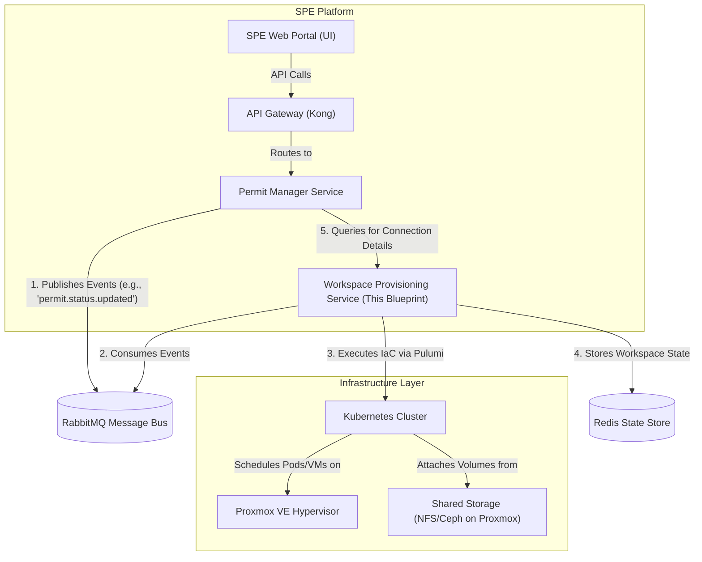

## Draft Blueprint: Workspace Provisioning Service

### 1. Introduction & Purpose

This document outlines the complete technical blueprint for the **Workspace Provisioning Service** (WPS), a core microservice within the Secure Processing Environment (SPE) platform.

The primary purpose of the WPS is to act as the **Infrastructure-as-Code (IaC) engine** for the entire SPE ecosystem. It is a backend service with no user-facing interface. It listens for events published by the **Permit Manager Service** and translates them into concrete actions on the virtualization and container orchestration layers (Proxmox and Kubernetes). Its sole responsibility is the automated, secure, and auditable lifecycle management of all ephemeral and persistent compute environments (workspaces) required by the SPE workflow.

This blueprint is designed for implementation by an AI coding agent. It is intended to be exhaustive, providing all necessary context from the provided BPMN flows, architecture diagrams, and frontend/backend code.

### 2. Core Responsibilities

-   **DO:** Programmatically provision, configure, and destroy all SPE virtual environments (VMs/containers) on demand.
-   **DO:** Manage the lifecycle of workspaces: Ingress Airlocks, HDAB Preprocessing, HDAB Review, Researcher Setup, and Researcher Analysis environments.
-   **DO:** Securely attach and detach appropriate storage volumes (`/raw`, `/prepared`, `/outputs`, shared project folders) with the correct read/write permissions for each phase.
-   **DO:** Configure network policies for each workspace, primarily managing the state of internet access (disabled, limited/proxied, enabled).
-   **DO:** Create dedicated user accounts within each workspace environment to ensure auditability.
-   **DO:** Store and manage the runtime state and connection details for each active workspace.
-   **DO NOT:** Manage the business logic or state of the permit itself. That is the responsibility of the **Permit Manager**.
-   **DO NOT:** Interact directly with end-users. It only responds to events from the Message Bus or internal API calls from other backend services.

### 3. Technology Stack & Prerequisites

-   **Language:** Python 3.11+
-   **Infrastructure as Code (IaC):** Pulumi with the Python SDK.
-   **Virtualization Platform:** Proxmox VE (latest stable version).
-   **Container Orchestration:** Kubernetes (K8s) cluster, running on VMs managed by Proxmox.
-   **Messaging:** RabbitMQ (as the event bus, listening for messages).
-   **State Storage:** Redis (for storing transient workspace state like IP addresses and connection tokens).
-   **Web Framework (for internal API):** FastAPI.

### 4. Architectural Overview

The WPS operates as a "headless" backend service. It subscribes to topics on the RabbitMQ message bus and exposes a simple internal API for status queries.



### 5. Core Concepts & Implementation Logic

#### 5.1. Workspace Definition
A "workspace" is not a persistent, long-running VM. It is a **Kubernetes Pod**. This pod will run a containerized version of a lightweight Linux desktop environment (e.g., XFCE with a VNC or RDP server). This approach is fundamental to achieving scalability.

#### 5.2. Pulumi Integration
The service will use the **Pulumi Automation API** for Python. This allows the Python application to programmatically drive Pulumi to create, update, and destroy infrastructure without needing to shell out to the Pulumi CLI. Each workspace provisioning action will correspond to running a dedicated Pulumi program.

-   **Pulumi Providers:** You will use the official `pulumi_kubernetes` provider to manage all K8s resources and a community or official provider for Proxmox (`pulumi_proxmoxve`) if direct interaction is needed beyond K8s.
-   **Dynamic Stacks:** Each active permit workspace can be managed as a separate Pulumi stack (e.g., `permit-001-analysis`). This provides excellent isolation of resources.

#### 5.3. Storage Management
The Kubernetes cluster must be configured with a **CSI (Container Storage Interface) driver** that can dynamically provision storage from the underlying Proxmox host (e.g., via NFS, iSCSI, or Ceph). The WPS will be responsible for:
1.  Creating `PersistentVolumeClaim` (PVC) resources in Kubernetes for `/raw`, `/prepared`, and `/outputs`.
2.  Creating a shared `ReadWriteMany` PVC for project collaboration if the storage backend supports it (e.g., NFS).
3.  Mounting these PVCs into the workspace pods with the correct `readOnly` or `readWrite` flags.

#### 5.4. User Creation and Auditing
Each workspace container/VM must be configured at runtime to create a unique, non-root user account for the assigned researcher or HDAB staff member.
-   **Mechanism:** This will be achieved by passing user details (username, UID, GID) as environment variables into the Kubernetes Pod specification.
-   **Entrypoint Script:** The Docker image for the workspace will have an entrypoint script that reads these environment variables and creates the user *before* starting the desktop environment/VNC server. This ensures all actions within the workspace are tied to a specific user.

### 6. Event-Driven Workflow: From Event to Infrastructure

The service must implement an event consumer (e.g., using the `pika` library for RabbitMQ) that listens for events published by the Permit Manager. The primary event is `permit.status.updated`.

Here is the required logic for each status transition:

| Triggering Event (from Permit Manager) | WPS Action | Implementation Details |
| :--- | :--- | :--- |
| `permit.status.updated` with status **`AWAITING_INGRESS`** | **Do Nothing.** Await specific initiation. | Wait for the `INITIATE_INGRESS` action from the HDAB team. |
| `permit.ingress.initiated` | **Provision Ingress Airlock.** | - Use Pulumi to create a K8s Pod running a minimal SFTP server container.<br>- Create a temporary user account for each assigned Data Holder.<br>- Mount a new, dedicated PVC for `/uploads/{data_holder_id}` in **Write-Only** mode for each user.<br>- Configure K8s `NetworkPolicy` to only allow ingress from the Data Holder's whitelisted IP.<br>- Store credentials and connection info in Redis. |
| `permit.status.updated` with status **`DATA_PREPARATION_PENDING`** | **Destroy Ingress Airlock, Provision HPE VM.** | - Use Pulumi to destroy all resources from the previous step.<br>- Provision a new K8s Pod for the HDAB Preprocessor.<br>- Mount the `raw` data volume (now consolidated from ingress) as **Read-Only**.<br>- Mount the `prepared` data volume as **Read-Write**.<br>- Create a user account for the assigned HDAB Preprocessor.<br>- Store connection info in Redis. |
| `permit.status.updated` with status **`DATA_PREPARATION_REVIEW_PENDING`** | **Deactivate HPE, Provision HRE VM.** | - Deactivate the HPE VM (stop the Pod but don't delete resources).<br>- Provision a new K8s Pod for the HDAB Reviewer.<br>- Mount the `prepared` data volume as **Read-Only**.<br>- Create user account for the Reviewer. |
| `permit.status.updated` with status **`DATA_PREPARATION_REWORK`** | **Destroy HRE, Reactivate HPE VM.** | - Destroy the HRE VM resources.<br>- Reactivate the HPE VM (start the Pod). |
| `permit.status.updated` with status **`WORKSPACE_SETUP_PENDING`** | **Destroy HPE/HRE, Provision Setup VM.** | - Destroy all previous VMs.<br>- Provision a new K8s Pod for the Researcher.<br>- **CRITICAL:** Configure `NetworkPolicy` to allow egress traffic ONLY through a whitelisted proxy to approved software repositories (e.g., PyPI, CRAN). **NO OTHER INTERNET ACCESS.**<br>- Do **NOT** mount any sensitive data volumes.<br>- Mount a shared project folder PVC. |
| `permit.status.updated` with status **`WORKSPACE_SETUP_REVIEW_PENDING`** | **Deactivate Setup VM, Provision Reviewer Access.** | - Deactivate the Setup VM (stop the Pod).<br>- Configure access for the HDAB Setup Reviewer to inspect the environment's configuration (this could be a read-only shell or a specific review interface). |
| `permit.status.updated` with status **`WORKSPACE_SETUP_REWORK`** | **Reactivate Setup VM.** | - Re-enable the Setup VM with the same limited internet access for the researcher to make changes. |
| `permit.status.updated` with status **`ANALYSIS_ACTIVE`** | **Finalize Analysis VM.** | - **CRITICAL:** Use Pulumi to update the K8s `NetworkPolicy` to **COMPLETELY DISABLE ALL INTERNET ACCESS**.<br>- Mount the `prepared` data volume as **Read-Only**.<br>- Mount the `outputs` volume as **Read-Write**.<br>- Mount the shared project folder.<br>- Start/reactivate the Pod. It is now the fully isolated Analysis VM. |
| `permit.workspace.stop_requested` | **Stop Analysis VM.** | - Stop the Pod but preserve all storage (`PVCs`). |
| `permit.workspace.start_requested` | **Start Analysis VM.** | - Start the previously stopped Pod. |
| `permit.status.updated` with status **`ARCHIVED`** | **Destroy Analysis VM.** | - Use Pulumi to destroy the compute resources (Pod) but **preserve the storage volumes (PVCs)** for the archival period. |
| `permit.deleted` | **Destroy All Resources.** | - Use Pulumi to destroy all associated resources for the permit, **including all storage volumes (`PVCs`)**. |

### 7. Internal API Specification (FastAPI)

The WPS should expose a minimal, internal-only REST API for other services.

-   **`GET /api/v1/workspaces/{permitId}/status`**
    -   **Purpose:** Allows the Permit Manager to query the current operational status of a workspace.
    -   **Response:**
        ```json
        { "status": "RUNNING" }
        ```

-   **`GET /api/v1/workspaces/{permitId}/connection`**
    -   **Purpose:** Provides the necessary details for the Guacamole gateway to connect to the workspace.
    -   **Response:**
        ```json
        {
          "connection": {
            "protocol": "rdp",
            "host": "10.1.2.3", // Internal K8s service IP
            "port": 3389,
            "username": "researcher-user",
            "password": "<temporary-secret-from-k8s>"
          }
        }
        ```

### 8. Pulumi Implementation Strategy

-   **Project Structure:** Organize the Pulumi code logically.
    ```
    pulumi_workspace_provider/
    ├── __main__.py          # Main entrypoint for Automation API
    ├── network.py           # Defines K8s NetworkPolicy resources
    ├── storage.py           # Defines K8s PersistentVolumeClaim resources
    ├── workspace.py         # Defines the K8s Pod/Deployment for the workspace
    └── config.py            # Handles configuration for different workspace types
    ```
-   **Main Application Logic:** The FastAPI application will contain the event consumer loop. When an event is received:
    1.  Parse the event payload to get the `permitId` and `status`.
    2.  Determine the required action based on the state machine table above.
    3.  Instantiate and run the Pulumi Automation API `Stack` for the given `permitId`, passing the required configuration (e.g., user info, network policy type, volumes to mount).
        ```python
        # Example snippet
        stack = auto.create_or_select_stack(
            stack_name=f"permit-{permit_id}",
            project_name="spe-workspace",
            program=pulumi_program # your Pulumi code function
        )
        stack.set_config("workspace_type", ConfigValue("ANALYSIS"))
        stack.set_config("user_name", ConfigValue("researcher-xyz"))
        stack.up(on_output=print)
        ```

### 9. Security & Auditing

-   **Least Privilege:** The service account used by the WPS to interact with Kubernetes and Proxmox MUST have the minimum necessary permissions to perform its duties.
-   **Immutable Infrastructure:** Workspaces should be treated as immutable. Changes should be made by destroying and recreating the container with new configuration, not by modifying a running container.
-   **Logging:** Every action taken by the WPS (provisioning, destroying, configuring) MUST be logged in detail to the central Auditing Service. Logs must include the triggering event ID and the permit ID.

### 10. Proposed Directory Structure for the Service

```
spe-workspace-provisioning-service/
├── src/
│   ├── api/
│   │   └── routes.py              # FastAPI internal routes
│   ├── events/
│   │   └── consumer.py            # RabbitMQ event consumer logic
│   ├── orchestration/
│   │   ├── main.py                # Main Pulumi Automation API driver
│   │   └── pulumi_programs/       # Directory for Pulumi Python code
│   │       ├── __init__.py
│   │       ├── workspace.py
│   │       ├── storage.py
│   │       └── network.py
│   ├── services/
│   │   └── state_manager.py       # Service to interact with Redis
│   ├── config.py                  # Application configuration
│   └── main.py                    # Main application entrypoint (starts API and consumer)
├── Dockerfile
├── requirements.txt
└── README.md
```

This blueprint provides a comprehensive and scalable vision for the Workspace Provisioning Service. It is now ready for the AI coding agent to begin implementation.