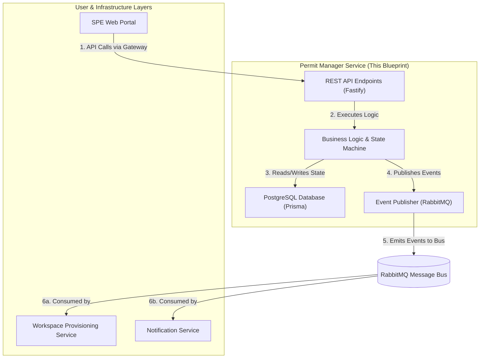

# SPE Permit Manager Service

## 1. Introduction & Core Responsibility

This document provides the high-level architectural and implementation blueprint for the **SPE Permit Manager Service**. This service is the central nervous system of the SPE platform, acting as the authoritative source of truth for the entire lifecycle of a data permit.

The complete permit manager source code is available for reference in the `permit_manager_code_for_reference/` directory at the root of this project. While this summary provides the necessary context, the agent may refer to the source code for specific implementation details, such as component logic, state management, and exact API client usage.

**Core Responsibility:** To manage the state, business logic, authorization, and auditing of all data permits, from initial creation through to final archival and deletion. It orchestrates the SPE workflow by processing requests from the frontend, enforcing business rules, and publishing events for other backend services to consume.

This service does **not** manage infrastructure (like VMs or storage) directly. Instead, it delegates these tasks by publishing events to the **Message Bus**, which are then consumed by the **Workspace Provisioning Service**.

## 2. Technology Stack

-   **Framework:** Fastify (Node.js)
-   **Language:** TypeScript
-   **Database:** PostgreSQL
-   **ORM:** Prisma
-   **Asynchronous Communication:** RabbitMQ (for publishing events)
-   **Authentication:** Verifies HMAC-SHA256 signed JWTs provided by the API Gateway.

## 3. Architectural Overview

The Permit Manager is a backend microservice that sits behind the API Gateway. It exposes a REST API for the frontend, interacts with a dedicated PostgreSQL database for persistence, and publishes events to a RabbitMQ message bus to trigger actions in other services.

## 4. Database Schema (Prisma)

The service's state is persisted in a PostgreSQL database managed by the Prisma ORM. The schema (`prisma/schema.prisma`) defines the core data models. The AI agent MUST adhere to this schema.

-   `Permit`: The central model representing a data access permit. It holds the `status` which drives the entire workflow.
-   `TeamMember`: Represents a member of the researcher's team assigned to a permit (e.g., Principal Investigator, Project Member).
-   `HdabAssignment`: Links an HDAB staff member (`userId`) to a specific `permitId` with a granular `permitRole` (e.g., `HDAB_DATA_REVIEWER`).
-   `DataHolderAssignment`: Links a Data Holder user to a permit.
-   `Output`: Records an egress request made by a researcher, including its folder path, justification, and review status.
-   `PermitStateLog`: An immutable log of all status transitions for a permit, providing a crucial audit trail.
-   `PermitActivityLog`: A detailed, human-readable log of significant actions performed on a permit (e.g., team member invited, output approved).

## 5. API Endpoints Specification

The service MUST implement the following RESTful API endpoints. All endpoints are prefixed with `/api`. Authorization checks are critical and must be performed for every request.

---

### 5.1 Authentication and User Endpoints

-   **`POST /auth/login`**: *Already implemented.* Handles user login.
-   **`POST /auth/logout`**: *Already implemented.* Handles user logout.
-   **`GET /me`**: *Already implemented.* Fetches the profile of the currently authenticated user.

---

### 5.2 Permit Lifecycle & Management Endpoints

-   **`GET /permits`**
    -   **Purpose:** List all permits accessible to the current user.
    -   **Authorization:** Any authenticated user. The service MUST filter the results based on the user's roles and assignments (team member, HDAB staff, data holder).
    -   **Response:** `200 OK` with `{ "permits": [PermitResponse, ...] }`. Permits MUST be transformed using `buildPermitResponse` to include summaries and apply redaction rules.

-   **`GET /permits/{permitId}`**
    -   **Purpose:** Fetch the detailed state of a single permit.
    -   **Authorization:** User must have specific access to this permit (team, HDAB, or data holder).
    -   **Response:** `200 OK` with `{ "permit": PermitResponse }`. The response MUST be transformed by `buildPermitResponse` to apply redaction.

-   **`POST /permits/{permitId}/review`**
    -   **Purpose:** The primary endpoint for HDAB staff to advance the permit's state machine.
    -   **Authorization:** HDAB staff with the appropriate role for the given stage (e.g., `HDAB_DATA_REVIEWER` for the `PREPARATION` stage). Super Admins and Permit Managers have override access.
    -   **Request Body:** `{ "stage": "PREPARATION" | "SETUP", "decision": "APPROVED" | "REWORK_REQUESTED", "comments": "..." }`
    -   **Logic:**
        1.  Validate that the permit's current status allows for this decision (see `reviewTransitions` in `permitService.ts`).
        2.  Update the permit `status` in the database.
        3.  Create a `PermitStateLog` entry.
        4.  Create a `PermitActivityLog` entry.
        5.  Publish a `permit.status.updated` event to the message bus.
    -   **Response:** `200 OK` with `{ "permit": PermitResponse, "message": "..." }`.

---

### 5.3 Team & Assignment Management Endpoints

-   **`POST /permits/{permitId}/team/invite`**: Invite a new member to the research team.
-   **`DELETE /permits/{permitId}/team/{memberId}`**: Remove a member.
-   **`POST /permits/{permitId}/hdab-team`**: Assign an HDAB staff member with a specific role.
-   **`DELETE /permits/{permitId}/hdab-team/{userId}`**: Un-assign an HDAB staff member.
-   **`GET /hdab/staff`**: Search for HDAB staff by name/email (for assignment dialogs).
-   **`POST /permits/{permitId}/data-holders`**: Assign a data holder.
-   **`DELETE /permits/{permitId}/data-holders/{holderId}`**: Un-assign a data holder.
-   **`GET /data-holders`**: Search for eligible data holders.
    -   **Authorization:** All team/assignment endpoints require specific management permissions (Principal Investigator, HDAB Permit Manager, or Super Admin).

---

### 5.4 Workspace & Egress Endpoints

These endpoints are called by the user, but their primary function is to update the permit state and/or publish an event for the **Workspace Provisioning Service**.

-   **`POST /permits/{permitId}/workspace/submit-for-review`**
    -   **Logic:** Transition permit status from `WORKSPACE_SETUP_PENDING` to `WORKSPACE_SETUP_REVIEW_PENDING` and publish a `permit.status.updated` event.

-   **`POST /permits/{permitId}/outputs`**
    -   **Logic:** Create a new `Output` record with status `EGRESS_REVIEW_PENDING`. Publish an `egress.submitted` event.

-   **`POST /permits/{permitId}/outputs/{outputId}/review`**
    -   **Logic:** Update the `Output` record's status (`EGRESS_APPROVED` or `EGRESS_REWORK`). Publish `egress.approved` or `egress.rework_requested` event.

---

### 5.5 Activity Log Endpoint

-   **`GET /permits/{permitId}/activity`**
    -   **Purpose:** Provide a filterable, paginated audit trail for a permit.
    -   **Authorization:** User must have access to the permit.
    -   **Logic:** Query the `PermitActivityLog` table. **Crucially, it must apply the redaction logic from `src/utils/redaction.ts`** to the `actor` and `targetUser` fields based on the viewer's role (e.g., an anonymous reviewer should not see the names of the research team).

## 6. Event Publication Contract

The service MUST publish events to a RabbitMQ exchange named `spe_events` using topic-based routing with the prefix `permit.`.

| Event Name | Trigger | Payload Example | Consumed By |
| :--- | :--- | :--- | :--- |
| **`permit.status.updated`** | Any change to a permit's `status` field. | `{ "permitId": "...", "newStatus": "ANALYSIS_ACTIVE", "previousStatus": "..." }` | **Workspace Provisioning Service**, Notification Service |
| **`permit.ingress.initiated`**| HDAB manager triggers the "Initiate Ingress" action. | `{ "permitId": "...", "dataHolders": [...] }` | **Workspace Provisioning Service** |
| **`egress.submitted`** | Researcher submits an output for review. | `{ "permitId": "...", "outputId": "...", "folderPath": "..." }` | Notification Service |
| **`egress.approved`** | HDAB reviewer approves an output. | `{ "permitId": "...", "outputId": "..." }` | **Workspace Provisioning Service**, Notification Service |
| **`egress.rework_requested`** | HDAB reviewer requests changes. | `{ "permitId": "...", "outputId": "..." }` | Notification Service |
| **`team.member_added`** | A new member is added to the research team. | `{ "permitId": "...", "userId": "...", "email": "...", "role": "..." }` | **Workspace Provisioning Service** (to manage user accounts) |
| **`team.member_removed`** | A member is removed. | `{ "permitId": "...", "userId": "..." }` | **Workspace Provisioning Service** |

## 7. Key Business Logic & Responsibilities

-   **State Machine Enforcement:** The service is the sole gatekeeper for all permit status transitions. It must rigorously enforce the allowed transitions defined in `src/services/permitService.ts`.
-   **Authorization:** Every API endpoint MUST be protected. Logic must verify not only that a user is authenticated but also that they have the correct global role (e.g., `HDAB_PERMIT_MANAGER`) or permit-specific role (e.g., `PROJECT_INVESTIGATOR`) to perform the requested action.
-   **Auditing:** Every state change and significant action (e.g., inviting a user, submitting an output) MUST result in a new entry in the `PermitActivityLog` table.
-   **Data Redaction:** The service MUST NOT leak sensitive identifying information. All permit data returned by the API must be processed through the redaction utilities to respect the "double-blind" requirements for anonymous reviewers.